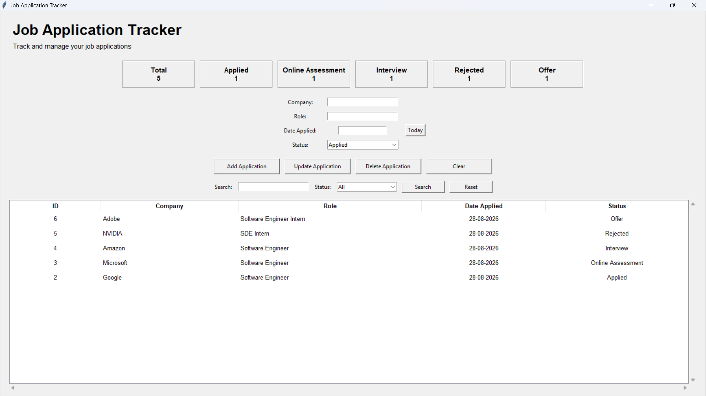

# Job Application Tracker

A desktop application for managing and tracking job applications using Python, Tkinter, and SQLite.

## Screenshot



## Features

- Add job applications
- View all applications
- Update application details
- Delete applications
- Search by company or job role
- Filter applications by status
- Sort applications by table columns
- Track application statistics through a dashboard
- Input validation
- Automatic current-date entry
- Persistent SQLite database storage

## Tech Stack

- Python
- Tkinter
- SQLite
- SQL

## Project Structure

```text
job-application-tracker/
│
├── app.py
├── database.py
├── ui.py
├── requirements.txt
├── .gitignore
└── README.md